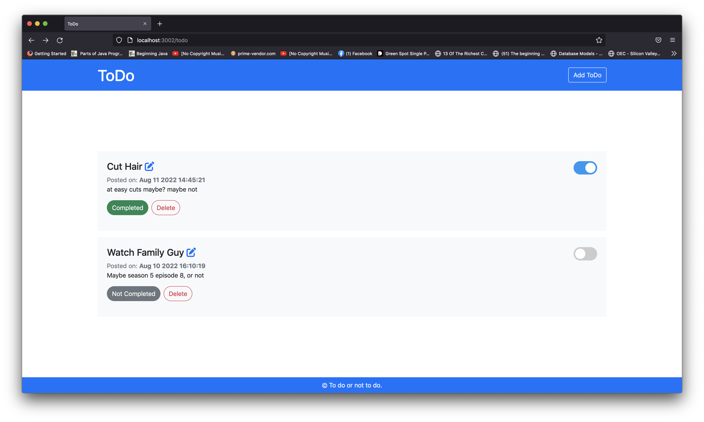
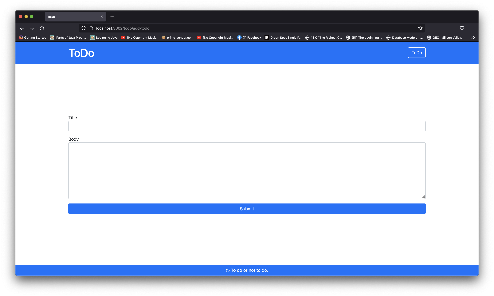
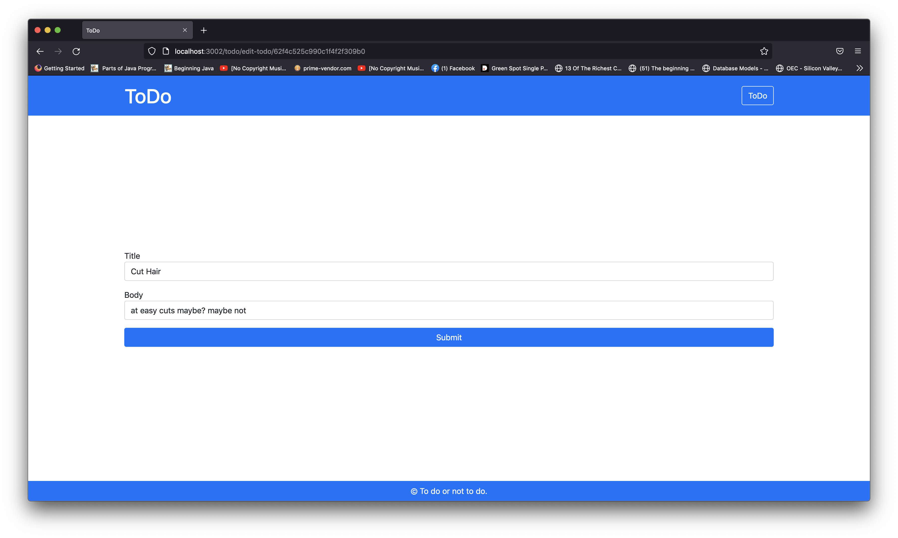

# nodeJS-todoApp
A simple ToDo app created to understand and practice the basics of Node JS and Express JS.
The target of this project was to understand CRUD operations and REST API. 

Code is available in ToDo branch.

Home Screen: 

Add Todo: 

Edit Todo:

